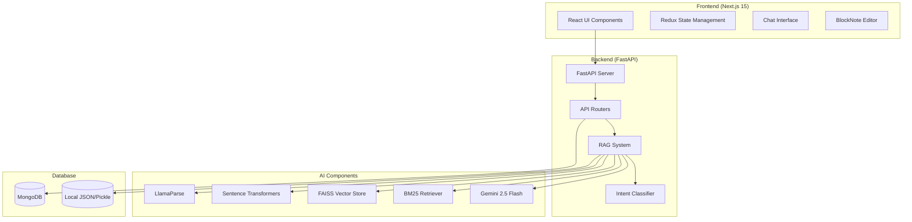
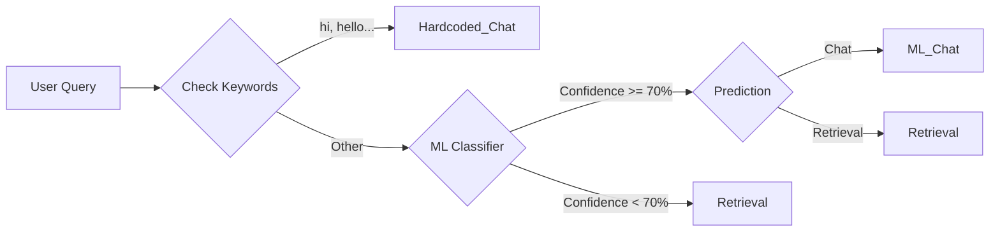
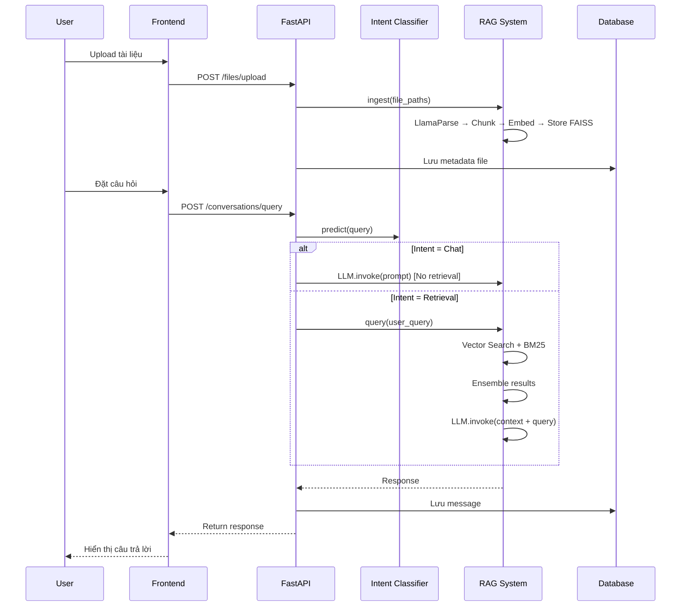

# NoteFlow - Hệ thống quản lý và truy xuất tri thức từ tài liệu cá nhân

## Tổng quan dự án

**NoteFlow** là một hệ thống Chatbot hỗ trợ học tập, sử dụng kỹ thuật **RAG (Retrieval-Augmented Generation)** để truy xuất và tổng hợp tri thức từ tài liệu cá nhân của người dùng. Hệ thống cho phép người dùng tải lên tài liệu, tổ chức thành các notebook, và đặt câu hỏi để nhận được câu trả lời dựa trên nội dung tài liệu đã tải lên.

---

## Kiến trúc hệ thống



---

## Cấu trúc thư mục

```
NoteFlow/
├── backend/                    # Backend FastAPI
│   ├── main.py                 # Entry point của FastAPI server
│   ├── ai/                     # Các module AI/RAG
│   │   ├── config.yaml         # Cấu hình RAG system
│   │   ├── rag_system.py       # Class RAGSystem chính
│   │   ├── rag_modules.py      # IntentClassifier, LLMClient, VectorDBClient
│   │   ├── rag_manager.py      # Quản lý các instance RAG theo notebook
│   │   ├── parser.py           # LlamaParse wrapper cho parsing tài liệu
│   │   ├── intent_classifer.py # Intent classification độc lập
│   │   ├── pipeline.py         # CLI interface cho RAG
│   │   └── intent_router.pkl   # ML model đã train cho intent
│   ├── routers/                # API endpoints
│   │   ├── conversationsRouter.py  # Quản lý cuộc hội thoại + query RAG
│   │   ├── filesRouter.py          # Upload/quản lý tài liệu
│   │   ├── notebookRouter.py       # Quản lý notebooks
│   │   └── noteRouter.py           # Quản lý ghi chú
│   ├── config/                 # Database configuration
│   │   ├── database.py         # Database interface
│   │   ├── local_backend.py    # Local JSON storage
│   │   └── mongo_backend.py    # MongoDB backend
│   └── schemas/                # Pydantic schemas
│
├── frontend/                   # Frontend Next.js
│   ├── src/
│   │   ├── app/                # Next.js App Router
│   │   │   ├── (client)/       # Client-side pages
│   │   │   │   ├── home/       # Trang chủ
│   │   │   │   └── notebook/   # Trang notebook
│   │   │   └── api/            # API routes
│   │   ├── components/         # React components
│   │   │   ├── client/         # Client components
│   │   │   ├── ui/             # UI primitives (Radix)
│   │   │   └── providers/      # Context providers
│   │   ├── redux/              # Redux store
│   │   ├── hooks/              # Custom hooks
│   │   └── lib/                # Utilities
│   └── package.json
│
└── report/                     # Báo cáo đồ án
    └── main.tex
```

---

## Thành phần chính

### 1. RAG System (Retrieval-Augmented Generation)

#### Cấu hình ([config.yaml](file:///c:/Users/nutbred/Desktop/new%20coding%20stuff/Notebook/NoteFlow/backend/ai/config.yaml))
| Thành phần | Giá trị | Mô tả |
|------------|---------|-------|
| LLM | `gemini-2.5-flash` | Model sinh câu trả lời |
| Embedding | `all-MiniLM-L6-v2` | Model tạo vector embedding |
| Chunk size | 1000 | Kích thước mỗi chunk tài liệu |
| Chunk overlap | 200 | Độ chồng lấp giữa các chunk |
| Retrieval k | 12 | Số lượng chunks truy xuất |

#### Hybrid Retrieval Strategy
Hệ thống sử dụng **kết hợp 2 phương pháp retrieval**:
1. **Vector Search (FAISS)**: Tìm kiếm semantic dựa trên embedding similarity
2. **BM25 Retriever**: Tìm kiếm lexical dựa trên từ khóa

Kết quả từ 2 phương pháp được **ensemble** để tăng độ chính xác.

---

### 2. Intent Classification (Phân loại ý định)

> **Mục đích**: Tiết kiệm tài nguyên API bằng cách phân loại câu hỏi trước khi xử lý.



| Intent | Xử lý |
|--------|-------|
| `Hardcoded_Chat` | Trả lời chitchat đơn giản, không gọi RAG |
| `ML_Chat` | Chitchat phức tạp, có thể không cần tài liệu |
| `Retrieval` | Câu hỏi về tài liệu, cần truy xuất và sinh câu trả lời |

---

### 3. Document Parsing

**LlamaParse** được sử dụng để parse tài liệu với các tính năng:
- Hỗ trợ PDF với OCR
- Trích xuất bảng biểu (HTML format)
- Parse song song nhiều file (`max_workers=10`)
- Ước lượng token count cho mỗi tài liệu

---

### 4. Backend API

| Router | Prefix | Chức năng |
|--------|--------|-----------|
| `conversationsRouter` | `/conversations` | CRUD cuộc hội thoại, query RAG |
| `filesRouter` | `/files` | Upload/download/xóa tài liệu |
| `notebookRouter` | `/notebooks` | Quản lý notebooks |
| `noteRouter` | `/notes` | Quản lý ghi chú |

#### Query Flow
```
POST /conversations/query/{conversationId}
    ├── Lấy notebookId từ conversation
    ├── RAGManager.get_rag(notebookId) 
    ├── Intent classification
    ├── RAG query với file filters (nếu có)
    └── Lưu message vào conversation
```

---

### 5. Frontend

**Tech Stack**:
- **Framework**: Next.js 15 (App Router + Turbopack)
- **State Management**: Redux Toolkit + Redux Persist
- **UI Components**: Radix UI primitives + Tailwind CSS
- **Editor**: BlockNote (rich text editor)
- **PDF Viewer**: react-pdf, react-doc-viewer
- **Markdown**: react-markdown với KaTeX, syntax highlighting

**Key Features**:
- Chat interface với markdown rendering
- Document upload và preview
- Notebook organization
- Note-taking với rich text editor

---

## Luồng hoạt động chính



---

## Các API Keys cần thiết

| Biến môi trường | Dịch vụ | Mục đích |
|-----------------|---------|----------|
| `GOOGLE_API_KEY` | Google AI | Gemini 2.5 Flash LLM |
| `LLAMA_PARSE_API_KEY` | LlamaCloud | Parse tài liệu PDF |
| `MONGODB_URL` | MongoDB Atlas | Database (optional, có local backend) |

---

## Cách chạy dự án

### Backend
```bash
cd backend
pip install -r requirements.txt
# Cấu hình .env với các API keys
python main.py
# Server chạy tại http://127.0.0.1:8000
```

### Frontend
```bash
cd frontend
npm install
npm run dev
# App chạy tại http://localhost:3000
```

### CLI Pipeline (Test RAG độc lập)
```bash
cd backend/ai
python pipeline.py
# Commands: ingest <path>, query <text>, list, debug <text>, exit
```

---

## Điểm nổi bật

1. **Hybrid Retrieval**: Kết hợp Vector Search + BM25 cho độ chính xác cao
2. **Intent Classification**: Tiết kiệm API call khi user chitchat
3. **Multi-notebook Support**: Mỗi notebook có RAG instance riêng
4. **Local + Cloud Database**: Hỗ trợ cả MongoDB và local JSON storage
5. **Parallel Document Parsing**: Parse nhiều file đồng thời
6. **Conversation TTL**: Tự động xóa conversation sau 3 ngày
